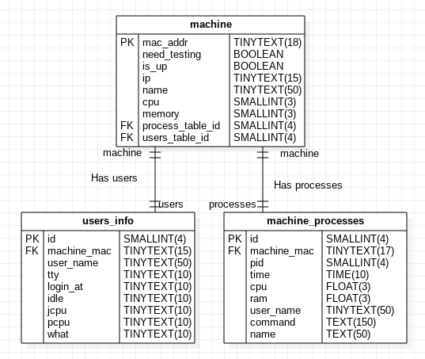

 
Entities
=====================================


1) A DB model can be designed by a ER model.


Machine

Attibutes:
MAC addr
IP
Computer Name
Status
Is up
Logged Users
Running Process
CPU usage
Memory Usage


Switch:
Key: Name
IP
Connected computers

User:
UserName
Name
Machine
TimeUsage




b)


c)
It can be implemented by a 2 modules: a centralized db, which runs at the monitor machine; and a daemon running in each machine to be monitored. The last one waits for a GET request. When it's sinalized, it answer, executing a POST request to the DB machine/API, retrieving a JSON with the following information:
- if does need testing
-Check if each machine is up
-Check the logged users
-Check the running processes
-Check CPU and memory usage

A second simpler implementation, but less scalable and works mostly to local nework: the monitor machine update the machines periodically by a poll. To each machine, is executed a bash script which connects by ssh, execute each command and retrieve a txt report file with each one of them. After get all files, a parse must be done, and then updating the DB.

it can be implemented by:

The list of current machines connected at local network can be retrieved by:
inet list


```
#!/bin/bash

machines_list=

while

wait(60)

for machine in {machines_list}:
ssh -i "{machine}_key.pem" $machine /bin/bash << EOF
    touch report.txt
    cat Does Need Test? > report.txt
    check_test > report.txt
    #print logged Users
    #running processes
    #cpu usage
    #Memory usage
EOF
scp -i "key_file.pem" $machine_addr: ~/report.txt report.txt

sql grep Test

```


Comands:
Process table:

```

ps -e -o,%p, -o time -o,%C, -o %mem -o,%U, -o %c | tr -s '[:blank:]' ',' | sed 's/^.//g' > process.csv && cat process.csv

```

CPU usage:

```

awk -F"," '{x+=$2}END{print "CPU usage %" x}' ./process.csv 
Total 11

```

MEM usage:

```
awk -F"," '{x+=$3}END{print "MEM usage %" x}' ./process.csv 
Total 11
```
 
users table:
```
w -f| awk '(NR>1)' | tr -s '[:blank:]' ',' > users.csv
```

MAC address:
```
ifconfig | grep -m1 -o -E '([[:xdigit:]]{1,2}:){5}[[:xdigit:]]{1,2}'
```

IP address:
```
ifconfig | grep -A 3 "wlp2s0" |grep -m2 -o -E "\b([0-9]{1,3}\.){3}[0-9]{1,3}\b" | head -1
```

HostName:
```
cat /proc/sys/kernel/hostname
```


# 2)


# 3) Conteiners

# 4)