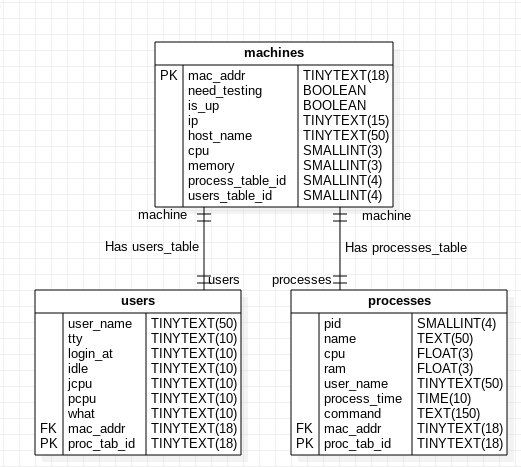
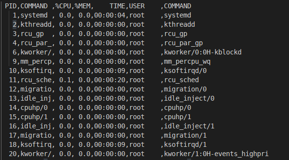

 
PART 1: Web Development & Automation
=====================================


## 1)
A database model can be designed by an ER model. The machine can be model as strong entities, since each one has an unique identifier, the MAC address. The process table, and users tables are weak entities with cardinality 1:1 to the machines. Because they don't have an own description identifier.
It's possible to list the most relevant attributes to store and monitor of each entity:
## Machine
  
MAC addr, IP, host Name, Is up, Users table, Running Process table, total CPU usage, total  Memory Usage.

## Process table:
PID, Process name, CPU usage, Memory usage, CPU time usage by process, command, machine_id, process_table_id

## User:
User name, CPU usage, login at machine, idle, terminal/instance of access, users table id, machine id.




b) 
The machines will be inserted in the database by importing CSV files corresponding to each one of them. 
There will be 3 files: one retrieving data of a single machine, another retrieving it's process and a last one retrieving it's users with statistics.
Those CSV tables will be retrieved by a background process detailed ahead.
## Sql scripit updates database with csv files data:
- /db/insert.sql

```
LOAD DATA LOCAL INFILE './machine_table.csv' 
INTO TABLE machinesdb.machines
FIELDS TERMINATED BY ',' 
LINES TERMINATED BY '\n'
IGNORE 1 ROWS; 


LOAD DATA LOCAL INFILE './process.csv' 
INTO TABLE machinesdb.processes
FIELDS TERMINATED BY ',' 
LINES TERMINATED BY '\n'
IGNORE 1 ROWS; 


LOAD DATA LOCAL INFILE './users.csv' 
INTO TABLE machinesdb.users
FIELDS TERMINATED BY ',' 
LINES TERMINATED BY '\n'
IGNORE 1 ROWS; 
```
- Database snapshot:


## Machines monitor index page source code:
- /monitor_webpage/index.php:
```
<?php

    $connection = mysqli_connect("localhost", "vektor", "");
    // prepare sql
    $sql = "SELECT * FROM machinesdb.machines";
    $result = mysqli_query($connection, $sql);
    // get number of rows in the table
    $rows_number = mysqli_num_rows($result);
    // fill the arrays with the rows data of stocks
    for ($i = 0; $i<$rows_number; $i++ )
    {
        $row = mysqli_fetch_array($result);
        $mac_array[$i] = $row["mac_addr"];
        $testing[$i] = $row["need_testing"];
        $is_up[$i] = $row["is_up"];
        $ip[$i] = $row["ip"];
        $name_array[$i] = $row["host_name"];
        $up_array[$i] = $row["is_up"];
        $cpu_array[$i] = $row["cpu"];
        $mem_array[$i] = $row["memory"];
    }
?>

<!DOCTYPE html>
<html>
  <head>
    <meta http-equiv="Content-Type" content="text/html;charset=utf-8">
    <link href="css/styles.css" rel="stylesheet" type="text/css">
    <title>Machines monitor</title>
  </head>
  <body>
    <div id="middle">  
        <h3>Machines</h3>
        <table style =" border-spacing: 18px; clear:both;">
            <tr>
                <th>MAC</th>      
                <th>Testing</th>        
                <th>power on  </th>          
                <th>IP</th>         
                <th>host name </th>        
                <th>CPU</th>       
                <th>Memory</th>
                <th>Users</th>       
                <th>Processes</th>       
            </tr>
            <?php for ($i = 0; $i < $rows_number; $i++) : ?>  
            <tr>
                <td> <?= $mac_array[$i]; ?> </td>
                <td> <?= $testing[$i]; ?> </td>
                <td> <?= $is_up[$i]; ?> </td>
                <td> <?= $ip[$i]; ?> </td>
                <td> <?= $name_array[$i]; ?> </td>
                <td> <?= $cpu_array[$i]; ?> </td>
                <td> <?= $mem_array[$i]; ?> </td>
                <td>  <a href="/users.php">Users</a>  </td>
                <td>  <a href="/processes.php">Process</a> </td>
            </tr>
            <?php endfor ?>
        </table>
    </div>
  </body>
</html>

```

- Query used to retrieve the machines Table:
```
    $sql = "SELECT * FROM machinesdb.machines";
```

## Machines webpage:


## Process monitor page source code:
- /monitor_webpage/process.php:
```
<?php
    $connection = mysqli_connect("localhost", "vektor", "");
    // find username
    $result = mysqli_query($connection, "SELECT * FROM machinesdb.processes");
    // get number of rows in the table
    $rows_number = mysqli_num_rows($result);
    // fill the arrays with the rows data of stocks
    for ($i = 0; $i<$rows_number; $i++ )
    {
        $row = mysqli_fetch_array($result);
        $pid[$i] = $row["pid"];
        $process_name[$i] = $row["process_name"];
        $cpu[$i] = $row["cpu"];
        $ram[$i] = $row["ram"];
        $process_time[$i] = $row["process_time"];
        $user_name[$i] = $row["user_name"];
        $command[$i] = $row["command"];
    }
?>
<!DOCTYPE html>
<html>
  <head>
    <meta http-equiv="Content-Type" content="text/html;charset=utf-8">
    <link href="css/styles.css" rel="stylesheet" type="text/css">
    <title>Process monitor</title>
  </head>
  <body>
    <div id="middle">  
        <h3>Process</h3>
        <table style =" border-spacing: 18px; clear:both;">
            <tr>
                <th>PID</th>      
                <th>ProcessName</th>        
                <th>CPU  </th>          
                <th>Memory</th>         
                <th>ProcessTime </th>        
                <th>UserName</th>       
                <th>Command</th>    
                <th>Machine</th>    
            </tr>
            <?php for ($i = 0; $i < $rows_number; $i++) : ?>
            <tr>
                <td> <?= $pid[$i]; ?> </td>
                <td> <?= $process_name[$i]; ?> </td>
                <td> <?= $cpu[$i]; ?> </td>
                <td> <?= $ram[$i]; ?> </td>
                <td> <?= $process_time[$i]; ?> </td>
                <td> <?= $user_name[$i]; ?> </td>
                <td> <?= $command[$i]; ?> </td>
                <td>  <a href="/index.php">Machine</a> </td>
            </tr>
            <?php endfor ?>
        </table>
    </div>
  </body>
</html>


```
- Query used to retrieve the machines Table:
```
    $sql = "SELECT * FROM machinesdb.process";
```
## Process webpage:

## Users webpage:


c) 

A simpler implementation, but less scalable and works mostly to the local network: the monitor machine updates the machines periodically by a poll. To each machine, is executed a bash script that connects by ssh, executes each command, and retrieves a CSV report file with each one of them. After getting all files, a parse must be done and then updating the DB.
The pooling background process can be implemented by the following commands:
 


## Local network machines:
The list of current machines connected to the local network can be retrieved by:
```
arp -vn
```
## Generating users table:

```
w -f| awk '(NR>1)' | tr -s '[:blank:]' ',' > users.csv
```

- Generated user csv file


## Generating process table:

```
ps -e -o %p, -o fname -o,%C, -o %mem, -o ,%x -o,%U, -o %c | sed 's/^.//g' > process.csv
```

- Generated process csv file



# Current machine statistics:

- Total CPU usage:

```
cpu_usage=$(awk -F"," '{x+=$2}END{print x}' ./process.csv)
```

- Current machine total MEM usage:

```
mem_usage=$(awk -F"," '{x+=$3}END{print x}' ./process.csv)
```
 


- MAC address:
```
mac_addr=$(ifconfig | grep -m1 -o -E '([[:xdigit:]]{1,2}:){5}[[:xdigit:]]{1,2}')
```

- IP address:
```
ip_addr=$(ifconfig | grep -A 3 "wlp2s0" |grep -m2 -o -E "\b([0-9]{1,3}\.){3}[0-9]{1,3}\b" | head -1)

```

- HostName:
```
host_name=$(cat /proc/sys/kernel/hostname)
```

- Store machines table:
```
echo mac_addr,need_testing,is_up,ip_addr,host_name,cpu_usage,mem_usage > machine_table.csv
echo $mac_addr,$need_testing,$is_up,$ip_addr,$host_name,$cpu_usage,$mem_usage >> machine_table.csv
```
- Generated machine csv file:


## d) Background process
The background process required is stored at background_process.sh. It uses ssh to connect to each machine, execute the formerly listed commands, and retrieve the table of the machine, using ssh copy "scp":
- /background_process.sh
```
#!/bin/bash

# Exit trap:

function trap_ctrlc() {

    exit 2
}

# Initialize tables:
mysql -u vektor < machinesdb_table_drop.sql
mysql -u vektor < machinesdb_table_create.sql

machines_list={192.168.1.32, 192.168.1.52}

while :
do

wait(60)

for machine in {machines_list}:
ssh -i "{machine}_key.pem" $machine /bin/bash << EOF
    # Get process table:
    ps -e -o %p, -o fname -o,%C, -o %mem, -o ,%x -o,%U, -o %c | sed 's/^.//g' > process.csv
    
    # Get users stats
    w -f| awk '(NR>1)' | tr -s '[:blank:]' ',' > users.csv
    
    # Get machine stats
    
    mac_addr=$(ifconfig | grep -m1 -o -E '([[:xdigit:]]{1,2}:){5}[[:xdigit:]]{1,2}')

    ip_addr=$(ifconfig | grep -A 3 "wlp2s0" |grep -m2 -o -E "\b([0-9]{1,3}\.){3}[0-9]{1,3}\b" | head -1)

    mem_usage=$(awk -F"," '{x+=$3}END{print x}' ./process.csv)

    cpu_usage=$(awk -F"," '{x+=$2}END{print x}' ./process.csv)
    need_testing=1
    is_up=1
    ps_id=32
    users_table_id=2
    host_name=$(cat /proc/sys/kernel/hostname)

    echo mac_addr,need_testing,is_up,ip_addr,host_name,cpu_usage,mem_usage > machine_table.csv
    echo $mac_addr,$need_testing,$is_up,$ip_addr,$host_name,$cpu_usage,$mem_usage >> machine_table.csv
EOF
scp -i "key_file.pem" $machine_addr: ~/machine_table.csv machine_table_${machine}.csv
scp -i "key_file.pem" $machine_addr: ~/process.csv process_${machine}.csv
scp -i "key_file.pem" $machine_addr: ~/users.csv users_${machine}.csv

mysql -u vektor  < insert.sql

done
```

## Another important statistics

- A statistic that was stored in the CPU time consumption of each process. It's important to monitor remote machines which were left at a prolonged processing job.

## Alternative implementation

A second implementation not detailed here but with higher scalability and robustness could be implemented this way: It can be implemented by 2 modules: a centralized DB, which runs at the monitor server; and a daemon running in each client machine to be monitored. The last one waits for a GET request. When it's signalized, it answers, DB machine/API, retrieving a JSON with the previously listed information.
# 2)
The decision if a task must be automated or not relies on the difference of time cost to automate it, versus the accumulated time consumed on repeating this task. If a task isn't usual or doesn’t consume much time, users can even don't use the automation. So, when working with a daily scheduled task, which spends more than 1 minute, 5 times is enough to decide whether implement automation or not.


# 3) Containers

I would proceed using containers, to encapsulate the application to the compatible kernel. The migration plan would be installing docker, set up MySQL8 in the container. The former database needs to be backed-up, exporting all the data to inside the database inside the container.

<br /> 
<br /> 

PART 2: Python
==========================
<br /> 

# 4)


A password validator was implemented to find all the characters which match the pattern corresponding to input requirements. After filter characters, join all of them and check if it matches with the specified length. The source code and unit tests are at the pass validator directory.

/pass_validator/pass_validator.py:
```
#!/usr/bin/python3
# -*- coding: utf-8 -*-

import sys
import re

def validator_regex(password, requirements):
    """
    Find all the characters who match the pattern
    corresponding to input requirements. 
    After filter characters, join all of them,
    and check if it matches the specified length.


    Args:
        password (str): Password to be validated.
        requirements (List[tuple]): List of rules.

    Returns:
        [bool]: True if password satisfies requirements.
    """
    does_pass=True
    for n_req in requirements:
        (operation, comparation, length) = n_req
        size = {
            '<': r"{,"+rf"{length-1}" + r"}",
            '>': r"{"+ rf"{length+1}"+ r",}",
            '=': r"{"+ rf"{length},"+f"{length}"+r"}"
        }
        req_dict = {
            "LEN": r".",
            "SPECIALS": r"[^a-zA-Z0-9]",
            "LETTERS": r"[a-zA-Z]",
            "NUMBERS": r"[0-9]",
        }
        rule_char = "("+req_dict[operation]+")"
        rule_size = (
            "("+req_dict[operation]+size[comparation]+")")
        match = ''.join(re.findall(rule_char,password))
        match = re.fullmatch(rule_size,match)
        match = "" if match == None else match.string
        does_pass = (does_pass 
            and match != None and match != "")
           
    return does_pass


```

Unit tests:
- /pass_validator/test_pass_validator.py
```
import pytest
from pass_validator import validator_regex
validator=validator_regex

def test_len_gt_fail():
    req = [('LEN', '=', 8), ('SPECIALS', '>', 1)]
    assert validator("12345678!@", req) == False

def test_validator_len_eq_ok():
    req = [('LEN', '=', 8), ('SPECIALS', '>', 1)]
    assert validator("@23a567!", req) == True

def test_spectial_count():
    req = [('LEN', '>', 8), ('SPECIALS', '>', 1), ('LEN', '<', 10)]
    assert validator("123@4567!", req) == True

def test_validator_gtr():
    req = [('LEN', '>', 8), ('SPECIALS', '>', 1), ('LEN', '<', 10)]
    assert validator("1234567981!", req) == False

def test_validator_eq():
    req = [('LEN', '>', 8), ('SPECIALS', '>', 1), ('LEN', '<', 10)]
    assert validator("123@567!81", req) == False

def test_validator_letters():
    req = [('LETTERS', '>', 2), ('SPECIALS', '>', 1), ('LEN', '<', 10)]
    assert validator("1abc@567!", req) == True

```
Validated behavior:


<br /> 
<br /> 
<br /> 

PART 3: Quality Assurance
=============================
5.)
=============================
The main way to guarantee that no new code can affect already implemented features is by using automated tests. They can be unit tests or automated structural tests. They must be executed whenever a new commit is done to the main branch.


<br /> 
<br /> 

PART 4: Logic, Common Sense and Scripting
=============================
6.)
=============================

A simple algorithm was chosen to control the elevator. It assumes  a uniform distribution of requests and destinations between the floors:

- The elevator has a capacity of X peoples.
 
- As long as there’s someone inside or ahead of the elevator who wants to go in the current direction, keep heading in that direction.

- Once the elevator has exhausted the requests in its current direction, switch directions if there’s a request in the other direction, if it's not completely loaded yet. Otherwise, stop and wait for a call.

Test 0: No one requested. Stay at current floor.

Test 1: 
One person requesting elevator. The elevator is idle, then it must go immediately to the requested floor.

Test 2: 
One person requesting elevator already in use. The elevator is in the way of requested floor, it must stop at the requested floor.

Test 3: 
One person requesting elevator already in use. If the elevator is NOT in the way of requested floor, so it must switch direction to the requested floor.

Test 4: 
X+1 persons requesting elevator to go to ground floor. It must attend X peoples THEN fetch the last one.

Test 5: 
X persons current in the elevator. It must stop whenever reaches a requested destination floor.


<br /> 
<br /> 

7.)
=============================
a)
It's implementation of insertion sort algorithm. It sorts in crescent order. And returns the sorted array.

b) Output:
```
5 6 8 12 34 35 38 44 55
```

c) The while loop shifts a large amount of the array whenever finds a smaller $val. It has complexity order of O(n²) of swaps and comparisons. It can be improved by:
is the inner loop, where is comparing each element with the selected element by the outer loop $var. Since the inner loop covers the sorted section of list, is possible to replace this linear search by a binary search method. 
